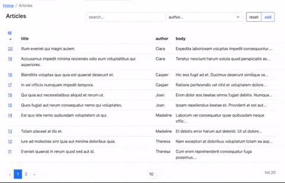

# Article Manage App using laravel livewire

requirements: laravel ^8.65 | 9.* | 10.*

## What is it?

is a laravel library of **blade components**, **livewire traits**, and **modules** scaffolder  that you can use to generate 
administration interfaces in a concise, reusable, uncluttered, and testable manner.

It also bundles standard frontend libraries like 
Bootstrap, Vue, Alpine, Tom Select and Quill to be used as fast boilerplate for your laravel admin panels.

The idea is to speed up and organize the development of large laravel applications:
- **modular approach** (you can organize your backends into reusable modules, isolating everything, components, views, tests, but also translations, migrations, jobs, each module can be like an isolated laravel application)
- **livewire component** based (no needed controllers, each component is naturally reactive, you can get away with few pure livewire classes and blade views, easily testable and maintainable)
- **blade component** based (dozens of available anonymous components to standardize frontend in few "bootstrap based" spacialized tags, which you can eventually extend)
